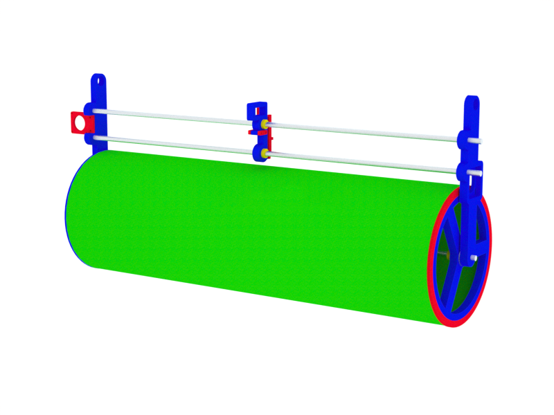

# Presto v2

*The project is currently in development, this repo is not complete yet.*

Presto is an open-source vector plotter designed to handle 70*100cm stock paper. It features a universal gripper to accomodate any tools from super-thin pencils to large paintbrushes.

Updates in v2:

- upgraded hardware for easy and fast (dis)assembly
- easy electronics, no need for 2 arduinos, servo is driven via a small ATTiny chip as slave
- host software for auto/manual printing, on-the-fly G-Code generation
- smaller part count, better integration of components: faster build, simpler manufacturing

## TODO

- design arduino shield PCB including 2 stepper drivers, 1 ATTiny45 to avoid the cable salad and don't have a slave board
- test clip-in system for shafts in side frames instead of current pressure screws, test plywood flex

## Get Started

go to the [How-To](howto.md).

## References

- [dented gear generation](http://hessmer.org/gears/InvoluteSpurGearBuilder.html).

## Thanks

Improvements on side frames and x-carriage thanks to Matt Maurer, Fabian Ritzi, Kevin Rentz @ Hyperwerk, Basel CH.
